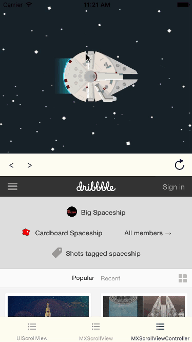

# MXParallaxHeader

[](https://travis-ci.org/maxep/MXParallaxHeader)
[](http://cocoapods.org/pods/MXParallaxHeader)
[](https://github.com/Carthage/Carthage)
[](http://cocoapods.org/pods/MXParallaxHeader)
[](http://cocoapods.org/pods/MXParallaxHeader)

MXParallaxHeader is a simple header class for UIScrollView.

In addition, MXScrollView is a UIScrollView subclass with the ability to hook the vertical scroll from its subviews, this can be used to add a parallax header to complex view hierachy. Moreover, MXScrollViewController allows you to add a MXParallaxHeader to any kind of UIViewController.

|             UIScrollView        |           MXScrollViewController          |
|---------------------------------|-------------------------------------------|
|||

## Usage

If you want to try it, simply run:

```
pod try MXParallaxHeader
```

+ Adding a parallax header to a UIScrollView is straightforward, e.g:

<details open=1>
<summary>Swift</summary>

```swift
let headerView = UIImageView()
headerView.image = UIImage(named: "success-baby")
headerView.contentMode = .scaleAspectFit

let scrollView = UIScrollView()
scrollView.parallaxHeader.view = headerView
scrollView.parallaxHeader.height = 150
scrollView.parallaxHeader.mode = .fill
scrollView.parallaxHeader.minimumHeight = 20
```
</details>

<details>
<summary>Objective-C</summary>

```objective-c
UIImageView *headerView = [UIImageView new];
headerView.image = [UIImage imageNamed:@"success-baby"];
headerView.contentMode = UIViewContentModeScaleAspectFill;

UIScrollView *scrollView = [UIScrollView new]; 
scrollView.parallaxHeader.view = headerView;
scrollView.parallaxHeader.height = 150;
scrollView.parallaxHeader.mode = MXParallaxHeaderModeFill;
scrollView.parallaxHeader.minimumHeight = 20;
```
</details>


+ The MXScrollViewController is a container with a child view controller that can be added programmatically or using the custom segue MXScrollViewControllerSegue.

+ Please check examples for **Swift** implementations.

## Installation

MXParallaxHeader is available through [CocoaPods](http://cocoapods.org). To install
it, simply add the following line to your Podfile:

```ruby
pod "MXParallaxHeader"
```

## Documentation

Documentation is available through [CocoaDocs](http://cocoadocs.org/docsets/MXParallaxHeader/).

## Author

[Maxime Epain](http://maxep.github.io)

[](https://twitter.com/MaximeEpain)

## License

MXParallaxHeader is available under the MIT license. See the LICENSE file for more info.
